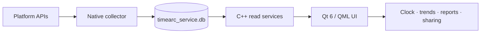

<div align="center">
  

# TimeArc

**Turn the time scattered across apps, web pages and devices into a local timeline that belongs only to you.**

Private by default · Local-first · Windows / macOS / Android

[Features](#features) · [Download](#download) · [Timing Rules](#timing-rules) · [Building](#building) · [Docs](#docs)

English · [简体中文](README.zh_CN.md)
</div>

> [!IMPORTANT]
> TimeArc `0.1` is currently a beta. The Windows test build is not signed yet, so please download it
> only from this repository's releases page; macOS still needs on-device signing, notarization and a
> permission regression pass, and Android/HarmonyOS still needs testing on more devices.

## What TimeArc Is

TimeArc collects foreground apps, media playback and a small set of explicitly defined background
activity on your machine, then turns the raw records into an app clock, daily/weekly/monthly/yearly
trends, category breakdowns and full per-app durations. It does not score your productivity, and it
never uploads raw window titles to the cloud.

| What you see                                                | How TimeArc does it                                                                                              |
| ----------------------------------------------------------- | ---------------------------------------------------------------------------------------------------------------- |
| Where today's time went                                     | An app clock that shows the real time ranges; hover or click to focus a single app                               |
| How weeks, months and years change                          | Time trends and category breakdown side by side, with fewer duplicate cards and less dead space                  |
| How long each program was really used                       | "All apps" shows current-period duration, cumulative duration and the most recent record — not just the top apps |
| Which activities deserve to keep counting in the background | Only media, voice channels and agents actively running a task use dedicated policies                             |
| Where the data lives                                        | Records are written to local SQLite; the UI is read-only and sharing is anonymized by default                    |

## Features

- **App clock**: draws app arcs at the times they actually happened; even a busy day can be focused down to one app.
- **Full statistics**: one information architecture across day, week, month and year, covering total duration, trends, categories and every app.
- **Media detection**: browser video on Windows reads the system media state first; sites such as Bilibili can be attributed to a site identity.
- **Voice channels**: Discord, KOOK and Oopz are recorded while a valid audio session exists, and stop once you leave the channel.
- **Agent tasks**: while Codex is in the foreground, CPU/I/O activity from its related worker processes can carry it across keyboard/mouse idle.
- **Game timing**: main processes such as Genshin Impact, Honkai: Star Rail, Zenless Zone Zero and Wuthering Waves keep recording while in the foreground, without being cut off by keyboard/mouse idle during controller play, cutscenes or loading.
- **App identity**: stable display names, icons and site identities; the settings page can customize the display name without changing the underlying ID.
- **Editable categorization rules**: app and site categories come from a rule table, and the settings page can change a category, disable a rule, create a new one, or restore the factory rules wholesale. Categories are computed at read time, so changes apply to all history immediately. The rule table matches on app name and window title, across platforms and languages (see [docs/categorization-system.md](docs/categorization-system.md)).
- **Local and reversible**: after the first successful launch you can enable login autostart for the current user, and it stays off once you turn it off.

## Platform Status

| Platform               | Readiness                                      | Current notes                                                                                                                                                             |
| ---------------------- | ---------------------------------------------- | ------------------------------------------------------------------------------------------------------------------------------------------------------------------------- |
| Windows 10/11          | **Primary test platform**                      | Foreground, idle, media, voice, agent, game policies and login autostart are all wired up; public builds are unsigned                                                     |
| macOS                  | **Code in sync, release verification pending** | The shared Qt/QML UI and the native collector service are implemented; still needs on-device permissions, signing, notarization, DMG and long-running regression on a Mac |
| Android                | **Feature preview**                            | Usage Access, live sync, app icons, statistics and sharing are implemented; different ROMs still need verification                                                        |
| HarmonyOS + Zhuoyitong | **Compatibility testing**                      | Runs on some Huawei devices, but it is not a native HarmonyOS app and compatibility is not guaranteed across all system versions                                          |
| Linux                  | **Not started**                                | X11/Wayland and PipeWire collection are still in the backlog                                                                                                              |

## Download

### Windows Test Build

The release artifacts include:

| File                                      | Who it is for                      | How to use it                                                        |
| ----------------------------------------- | ---------------------------------- | -------------------------------------------------------------------- |
| `TimeArc-0.1-beta-<date>-win64-setup.exe` | General testers                    | Run the installer and follow the prompts                             |
| `TimeArc-0.1-beta-<date>-win64.zip`       | Portable testing / troubleshooting | Extract and run `TimeArc.exe`; do not copy the single exe on its own |

After installation, the first launch tries to enable login autostart for the **current Windows user**;
once you turn it off in settings, the next launch will not turn it back on.
Unsigned test builds may trigger SmartScreen — check the SHA-256 published on the releases page first.

### Android / HarmonyOS

After installing the ARM64 APK, grant "Usage access" in system settings; re-entering TimeArc will sync
recent records immediately. Running on HarmonyOS through Zhuoyitong is a compatibility-layer approach;
see the [Android README](android/README.md) for detailed permissions, ABIs and troubleshooting.

### macOS

The repository ships build scripts, but a public release still requires completing the Accessibility
permission flow, signing, notarization and clean-machine verification on a Mac. Do not treat an
unverified local `.app` as an official release.

## Timing Rules

TimeArc computes the **union of valid activity intervals** — a period that counts as both "foreground"
and "media" at the same time is not counted twice.

| Scenario                                 | When it keeps recording                                                                                         | When it stops                                                                 |
| ---------------------------------------- | --------------------------------------------------------------------------------------------------------------- | ----------------------------------------------------------------------------- |
| Regular desktop apps / regular web pages | The app is in the foreground and the idle threshold has not been exceeded                                       | You switch away, or the idle threshold is exceeded                            |
| Browser video (including Bilibili)       | The Windows media state is `Playing`; it falls back to volume activity only when the media state is unavailable | Paused, closed, or the session disappears                                     |
| Players such as NetEase Cloud Music      | A valid media/audio session is playing                                                                          | Paused, or the session ends                                                   |
| Discord / KOOK / Oopz                    | The dedicated audio session is Active and not muted — nobody has to be speaking                                 | You leave the channel, mute, or the session goes Inactive/disappears          |
| Codex                                    | Codex is in the foreground and its official related worker processes show substantial CPU/I/O change            | After the task ends, once a short lease expires and the idle condition is met |
| Anime games                              | A recognized game's main process is in the foreground                                                           | You switch out of the game, or the main process exits                         |
| Other background processes               | **Not recorded**; the mere existence of a process does not prove it is being used                               | —                                                                             |

For the full collection boundaries, configuration and database contract, see the
[collector service README](src/service/README.md).

## Privacy and Data

- Raw records stay on your machine by default; no account or cloud service is required.
- The GUI never writes collection history directly; the native service is the only writer, and the two sides cooperate through a SQLite contract.
- Share cards strip sensitive information such as raw titles, contacts, URLs and package names by default.
- Do not upload `timearc_service.db` with your test feedback — it can contain app and window titles.

Common data directories:

| Platform        | Directory                                                             |
| --------------- | --------------------------------------------------------------------- |
| Windows         | `%APPDATA%\TimeArc\service\timearc_service.db`                        |
| macOS           | `~/Library/Application Support/TimeArc/service/timearc_service.db`    |
| Linux (planned) | `${XDG_DATA_HOME:-~/.local/share}/TimeArc/service/timearc_service.db` |

## Architecture



- `src/service/`: the Windows C / macOS Swift / Linux placeholder collectors and the shared disk contract.
- `src/services/`: Qt/C++ read-only statistics, settings, app identity and the mobile bridge.
- `qml/desktop/`, `qml/mobile/`: the desktop and mobile interfaces under a shared product language.
- `android/`: UsageStats, WorkManager, icons and Android lifecycle adaptation.
- `resources/`: backgrounds, site icons, monthly reports, licenses and release assets.

## Building

### Windows

Requirements: Qt `6.11.0` MinGW 64-bit, CMake, Python 3, Node.js (for the statistics JS tests).

```powershell
python .harness/tools/preflight.py --track B
cmake -S . -B build -G "MinGW Makefiles" `
  -DCMAKE_PREFIX_PATH="D:/TimeArc/QT/6.11.0/mingw_64"
python .harness/tools/build.py --track B
ctest --test-dir build --output-on-failure
```

Run during development:

```powershell
.\run.cmd
```

Package a release:

```powershell
pwsh tools/package-release.ps1 -Version 0.1-beta-20260825
pwsh tools/package-installer.ps1 -Version 0.1-beta-20260825
```

The first command dynamically verifies the Qt DLL links, collects the GUI/service, RCC, Qt/MinGW
runtimes and licenses, and produces the portable ZIP; the second wraps that same verified ZIP into a
current-user installer using the SFX module from the official 7-Zip LZMA SDK. By default the installer
script reads the official `7za.exe` and `7zS2.sfx` from the Git-ignored `.local-toolchains/7zip-26.02/`,
but another local path can be passed as an argument.

### macOS

```bash
./tools/build-macos.sh
```

The script handles the basic `.app` layout; signing, notarization, permissions and clean-machine QA
are still release gates.

### Android

Android is built by the Qt Android toolchain together with the `android/` Gradle wrapper. See
[android/README.md](android/README.md) for the detailed structure and device requirements.

## Verification

All builds must go through the harness wrapper, and the following must be run before committing:

```powershell
python .harness/tools/build.py --track B
ctest --test-dir build --output-on-failure
node tests/stats_view_model_test.js
python .harness/tools/harness_check.py
```

After running Qt/QML, also run `python .harness/tools/scan_qt_log.py`. For detailed development rules,
see [AGENTS.md](AGENTS.md) and [.harness/README.md](.harness/README.md).

## Docs

| Entry point                                                        | Contents                                                                         |
| ------------------------------------------------------------------ | -------------------------------------------------------------------------------- |
| [docs/README.md](docs/README.md)                                   | A documentation map organized by product, statistics, timing, mobile and release |
| [docs/implementation-backlog.md](docs/implementation-backlog.md)   | The currently actionable backlog                                                 |
| [docs/beta-tester-release-kit.md](docs/beta-tester-release-kit.md) | Tester recruiting, video script and feedback templates                           |
| [src/service/README.md](src/service/README.md)                     | The collector service, configuration, CLI and database contract                  |
| [android/README.md](android/README.md)                             | Android/HarmonyOS permissions, sync, builds and troubleshooting                  |
| [.harness/README.md](.harness/README.md)                           | The agent/human engineering quality gates                                        |

## Contributing

1. Read [AGENTS.md](AGENTS.md) and the boundaries for your platform first.
2. Solve one verifiable problem per commit; a new timing policy must start with a failing test.
3. Do not change the SQLite disk contract, do not pull Qt into the native service, and do not commit machine-specific launch scripts.
4. State the verification commands you actually ran, the platform, known limitations and privacy impact in the PR.

## Roadmap

- [x] Windows foreground, idle, media, voice, agent and game timing.
- [x] The daily/weekly/monthly/yearly statistics rework and full per-app durations.
- [x] Android UsageStats, live sync, icons and share previews.
- [ ] Windows code signing, the installer/upgrade path and clean-machine QA.
- [ ] macOS on-device permissions, signing, notarization, DMG and long-running verification.
- [ ] Android/HarmonyOS multi-ROM regression.
- [ ] Linux X11/Wayland + PipeWire collection.
- [ ] Optional end-to-end encrypted cross-device sync.

## License

TimeArc is licensed under **GPL-3.0-or-later**. See [LICENSE](LICENSE).
Qt is dynamically linked under LGPL/GPL terms. SQLite, Parson and MinGW runtime notices are bundled under
`resources/licenses/` and included in release packages.
